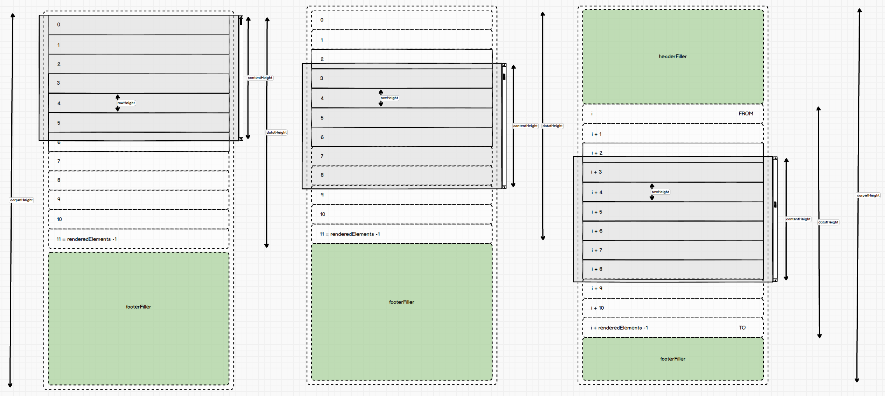
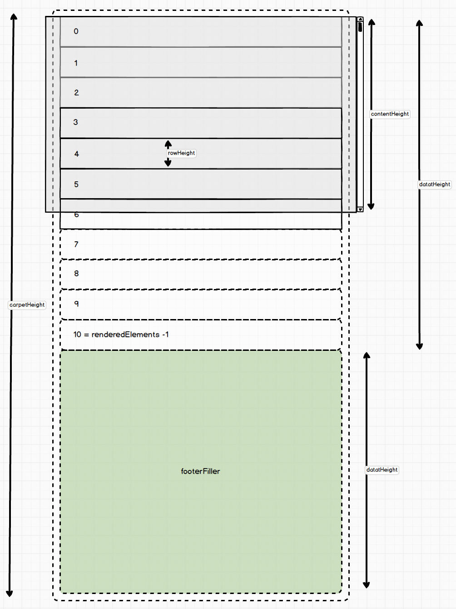
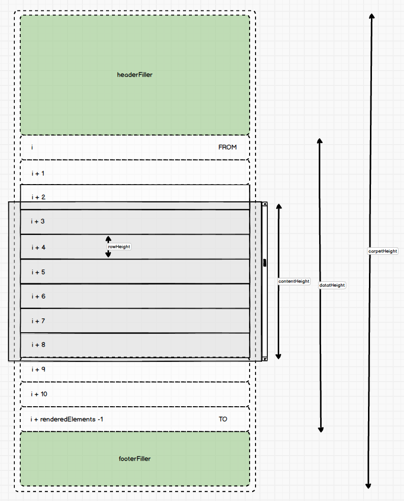

# Details about the Table



## Informations we need
- **rowHeight**  
    yeah will be fixed
- **height**  
    corresponds to the height of the table
- **width**  
    corresponds to the width of the table, but is nto really relevant for the following analysis.
- **gap**  
    number of elements anyway rendered at the top and the bottom of the somehow visible elements (gap = 2 in the pic above)
- **data**  
    a huge amount of data that we would like to represent in the table but we can really think of rendering all of them together.

## The idea  
It will seem quite simple, and till a certain point this is true. Let's reach that point first.  
We compute the _carpetHeight_ as 
``` js
carpetHeight = data.length * rowHeight;
```
we also need to compute the number of elements that we will really render as:
``` js
renderedElements = 2 * gap + Math.ceil(height / rowHeight) + 1;
```
Adding 1 might seem strange but take a better look, what we really want is to always have _gap_ elements rendered always invisible at the top and at the bottom (but for the two edge cases).  
Later we'll thinking about filtering and we will inplicitly also clearly consider and solve another edge case where there is more space than content.


## Filler \<tr/\>
We can create some very useful `<tr>` tags containing just one empty `<td/>` tag (with a _colSpan_ attribute equal to the number of columns of our table). We will exploit two of those Filler _tr_ tags changing rapidly the height of the contained _td_.

## Filler, Data, Filler  
Now at the very first render of the Table we can imagine to render a Filler with 0 height, then the very first `renderedElements` of data, then another Filler that allows us to reach exactly `carpetHeight`.



should be clear that:  

``` js
footerFillerHeight = carpetHeight - dataHeight;
```
where  
``` js
dataHeight = renderedElement * rowHeight;
```

### Scroll  
Thanks to the Fillers, when scrolling (at least till we see some rendered elements) will our table look exactly as if all elements were rendered? The answer is 100% positive. Clearly we now need to solve the quite real case when the user scrolls down enough to see nothing.  

First question: when should we do something?  

I would answer:  when `scrollTop > (gap + 1) * rowHeight`, but we need to not forget that the `<headerFiller>` plays a crucial role in our approach, thus seems better when:  
`scrollTop > headerFillerHeight + (gap + 1) * rowHeight`

When it happens we can in order:
- compute the index in `data` of the first element we will render as  
    `FROM = ceil(scrollTop / rowHeight)`
- compute the index in `data` of the last element we will render as  
    `TO = FROM + renderedElements - 1`  
- compute the new headerFillerHeight as  
    `headerFillerHeight = FROM * rowHeight`
- compute the new footerFillerHeight as  
    `footerFillerHeight = carpetHeight - headerFillerHeight - dataHeight`
- finally rerender `headerFiller`,  `data.slice(FROM, TO + 1)` related rows,  `footerHeight`


