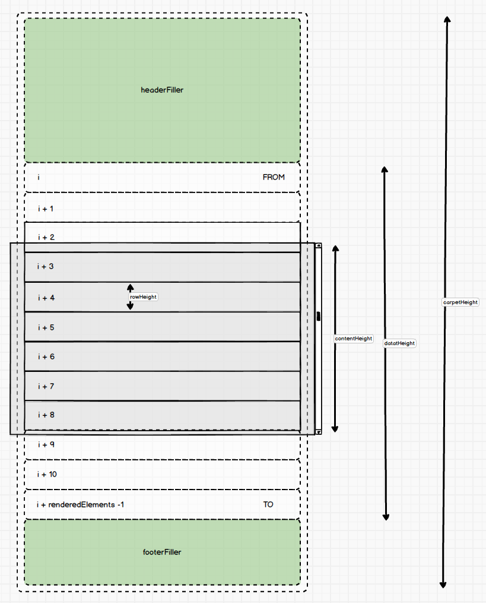

# Details about the Table


## Informations we need
- **rowHeight**  
    yeah will be fixed
- **height**  
    corresponds to the height of the table
- **width**  
    corresponds to the width of the table, but is nto really relevant for the following analysis.
- **gap**  
    number of elements anyway rendered at the top and the bottom of the somehow visible elements (gap = 2 in the pic above)
- **data**  
    a huge amount of data that we would like to represent in the table but we can really think of rendering all of them together.

## The idea  
It will seem quite simple, and till a certain point this is true. Let's reach that point first.  
We compute the _carpetHeight_ as 
``` js
carpetHeight = data.length * rowHeight;
```
we also need to compute the number of elements that we will really render as:
``` js
renderableElements = 2 * gap + Math.ceil(height / rowHeight) + 1;
```
Adding 1 might seem strange but take a better look, what we really want is to always have _gap_ elements rendered always invisible at the top and at the bottom (but for the two edge cases).  
Later we'll thinking about filtering and we will inplicitly also clearly consider and solve another edge case where there is more space than content.


## Filler \<tr/\>
We can create some very useful `<tr>` tags containing just one empty `<td/>` tag (with a _colSpan_ attribute equal to the number of columns of our table). We will exploit two of those Filler _tr_ tags changing rapidly the height of the contained _td_.

## Filler, Data, Filler  
Now at the very first render of the Table we can imagine to render a Filler with 0 height, then the very first `renderableElements` of data, then another Filler that allows us to reach exactly `carpetHeight`.


should be clear that:  

``` js
footerFillerHeight = carpetHeight - dataHeight;
```
where  
``` js
dataHeight = renderedElement * rowHeight;
```

### Scroll  
Will our table look exactly as if all elements were rendered? The answer is 100% positive. The only noticeable difference is when we scroll "a lot", in that case the scrolling debounce time can make a huge difference thus, in case the _loader_ seems to appear too frequently we need to tune down the scrolling debounce time. Clearly we now need to solve the quite real case when the user scrolls down enough to see nothing.  

First question: when should we consider to render different rows subset?  

Not forgetting about how the header `<Filler/>` when:  
`scrollTop > headerFillerHeight + (gap + 1) * rowHeight`

When it happens we can in order:
- compute the index in `data` of the first element we will render as  
    `FROM = ceil(scrollTop / rowHeight)`
- proceed only if the new `FROM` differs from the previous `FROM`
- compute the index in `data` of the last element we will render as  
    `TO = FROM + renderableElements - 1`  
- compute the new headerFillerHeight as  
    `headerFillerHeight = FROM * rowHeight`
- compute the new footerFillerHeight as  
    `footerFillerHeight = carpetHeight - headerFillerHeight - dataHeight`
- finally rerender `headerFiller`,  `data.slice(FROM, TO + 1)` related rows,  `footerHeight`





### SORTING  
Sorting does not affect the approach since the difference is only which elements we are showing: exactly same [FROM, TO] slice but starting from a differently sorted array.

### FILTERING
Filtering adds the problem that the `carpetHeight` changes as the filter varies the cardinality of our dataset.
Given we need to re-compute all relevant variables there's an additional problem about the scrollbar. The solution depends on the UX we want to implement for the user. So let's get a look at the problem first.  

Let's suppose our dataset contains 1k elements. The user scrolls down to the point where 1/4 of the dataset disappeared at the top, thus the scrollbar should also be at ~1/4 of its whole possible movement from the top. At that point `scrollTop` will be more or less `250 * rowHeight`, almost all of this space is in the header Filler, the rest in the header's side gap rows (depending how big the gap is set). All good.  
Now the user filter one row and the resulting dataset contains 300 items.  
Would we want to:
- the scroll should be resetted automatically to 0?  or 
- attempt to mantain the scrolling position proportion we had before filtering? thus ~75 elements already up and show to the user from ~76 to what fits in the table height.  
For the moment it will reset to 0, no way to change this behavior for the user.
I aim to make it configurable using a `filterResetScroll` set by default to false, thus if the user do not set it to true, we need to attempt to mantain the scrolling ratio (scrolled/scrollspan).  
Clearly there is a small edge case that occurs when the filtered elements are so few to make the vistualization unuseful or also to give no elements at all.
